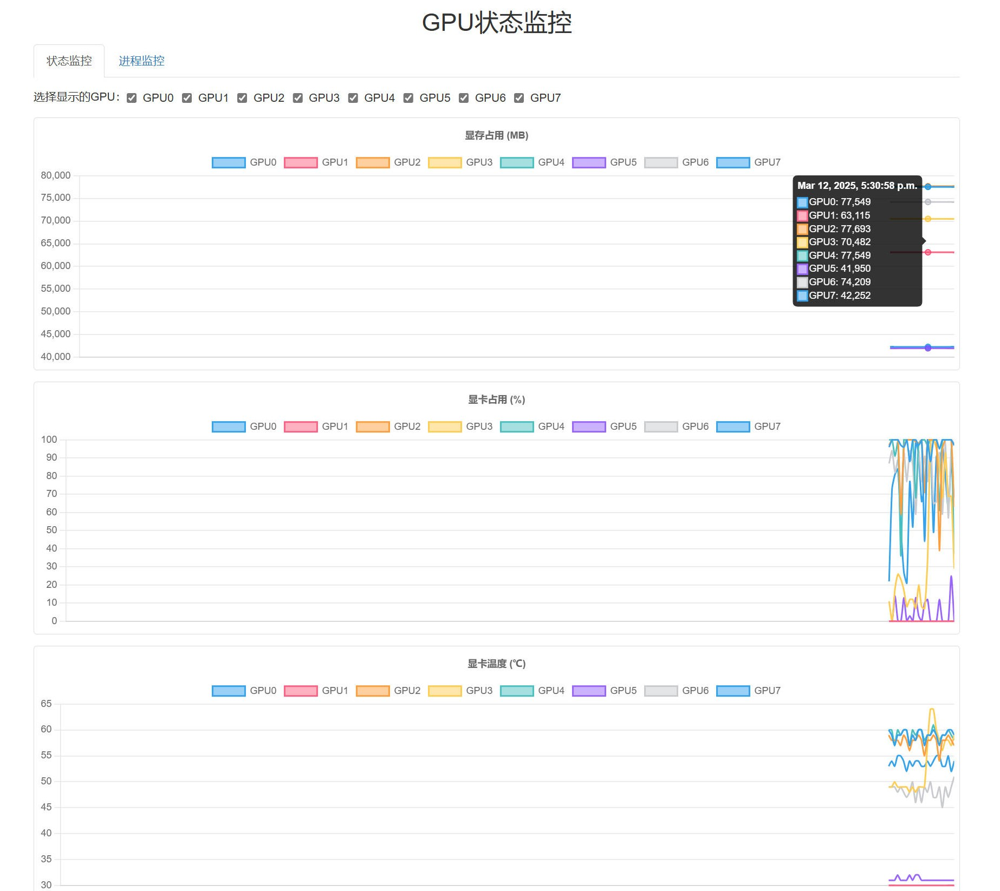
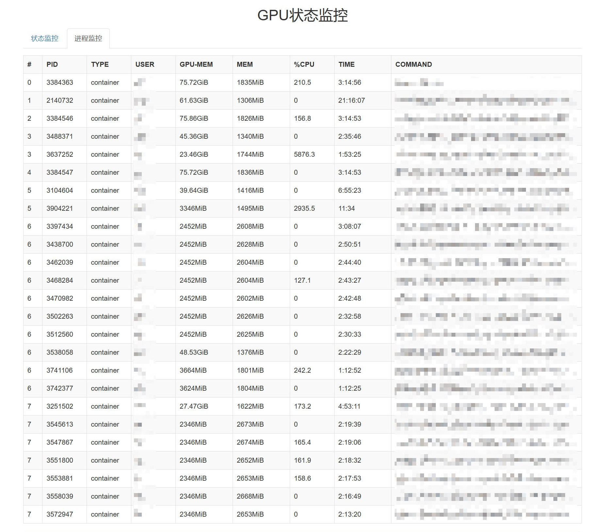

# GPU 状态监控器

## 简介
通过浏览器实时查看 GPU 的工作状态，包括显存占用、显卡占用、显卡温度、显卡功耗、进程信息等。

## 快速开始
克隆本仓库
```bash
git clone https://github.com/haowang02/gpu-monitor.git
```

创建虚拟环境并安装依赖
```bash
cd gpu-monitor
python3 -m venv .venv
source .venv/bin/activate
pip install -r requirements.txt
```

启动服务
```bash
gunicorn gm:app
```

## 配置
修改 `gunicorn.conf.py` 文件配置端口、进程数、日志等。

## 使用 systemd
在 Linux 系统下，使用 systemd 可以方便地控制 gpu-monitor 的启动、停止、配置后台运行以及开机自启动。

以下是具体的操作步骤：

### 创建 systemd 服务文件

```bash
sudo vim /etc/systemd/system/gpu-monitor.service
```

写入如下内容

```bash
[Unit]
Description=GPU Monitor with Gunicorn
After=network.target

[Service]
WorkingDirectory=/path/to/gpu-monitor
ExecStart=/path/to/gunicorn gm:app
User=<username>
Group=<groupname>
Restart=on-failure

[Install]
WantedBy=multi-user.target
```

### 加载服务并设置开机自启动
```bash
sudo systemctl daemon-reload               # 重新加载 systemd 配置
sudo systemctl start gpu-monitor.service   # 启动服务
sudo systemctl enable gpu-monitor.service  # 开机自启动
```

### 查看服务日志
```bash
sudo journalctl -u gpu-monitor.service -f
```

## 效果展示
状态监控


进程监控
